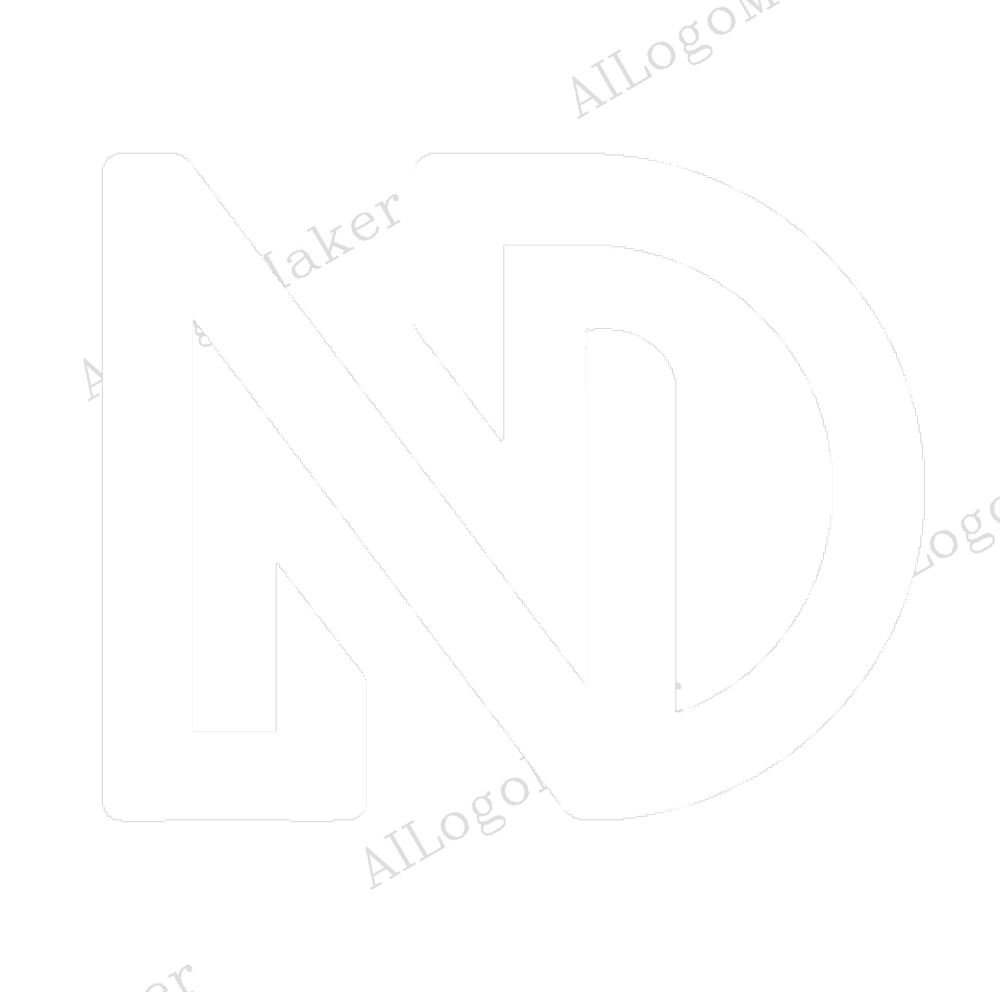
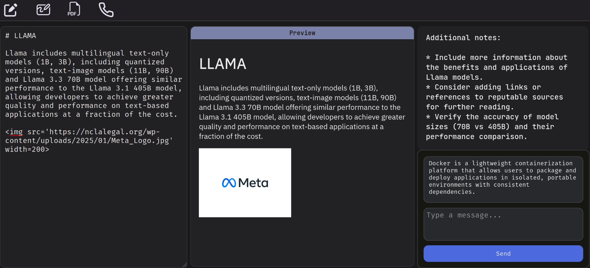

# Neodesk

Neodesk is an AI assisted note taking software that operates on Markdown files.
It also includes a whiteboard to make freehand diagrams and doodles.

Neodesk is built using the Svelte web framework and LLAMA-3.2:3B model.

## Technologies used
- HTML,CSS
- [Svelte](https://svelte.dev/)
- [Ollama](https://ollama.com/)
- [LLAMA3.2](https://ollama.com/library/llama3.2)

## Installation and Usage
Docker image for neodesk is available in the docker hub
To install pull the image and run as:

    
    docker image pull sinkobobux/neodesk:latest
    docker run -d --rm --name=neodesk -p 5173:5173 neodesk:latest
    
    
## LICENSE
Neodesk is licensed under the MIT license. See [LICENSE](./LICENSE) for details.